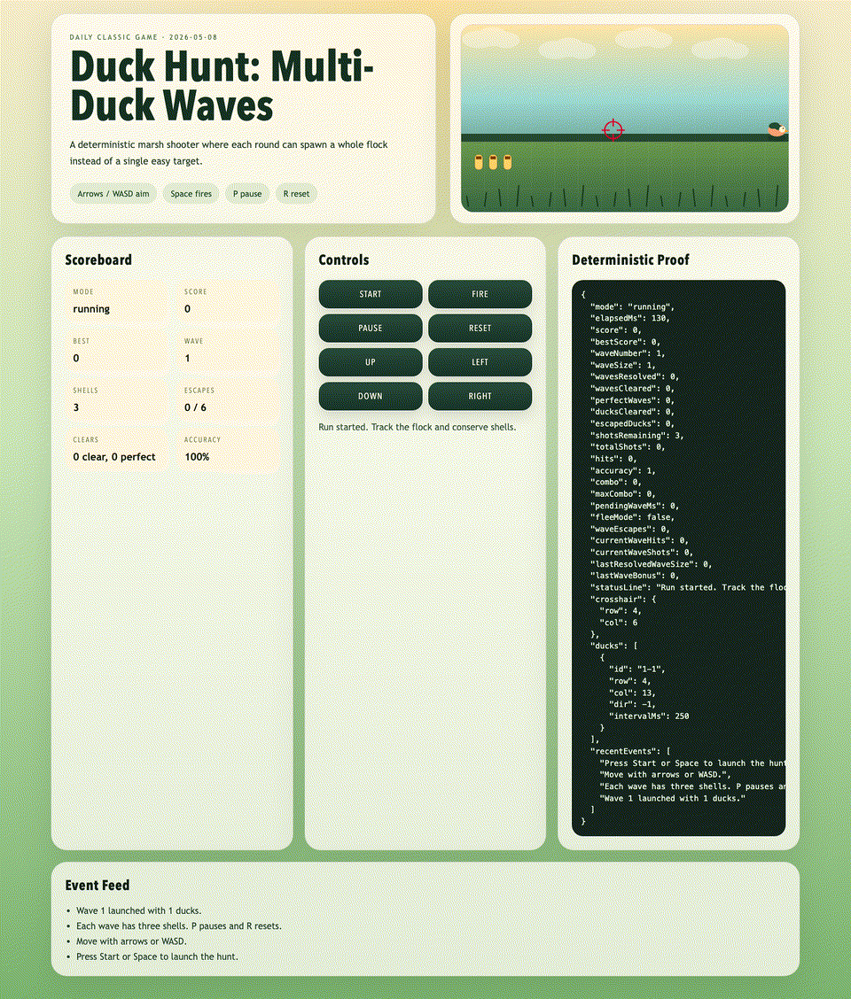
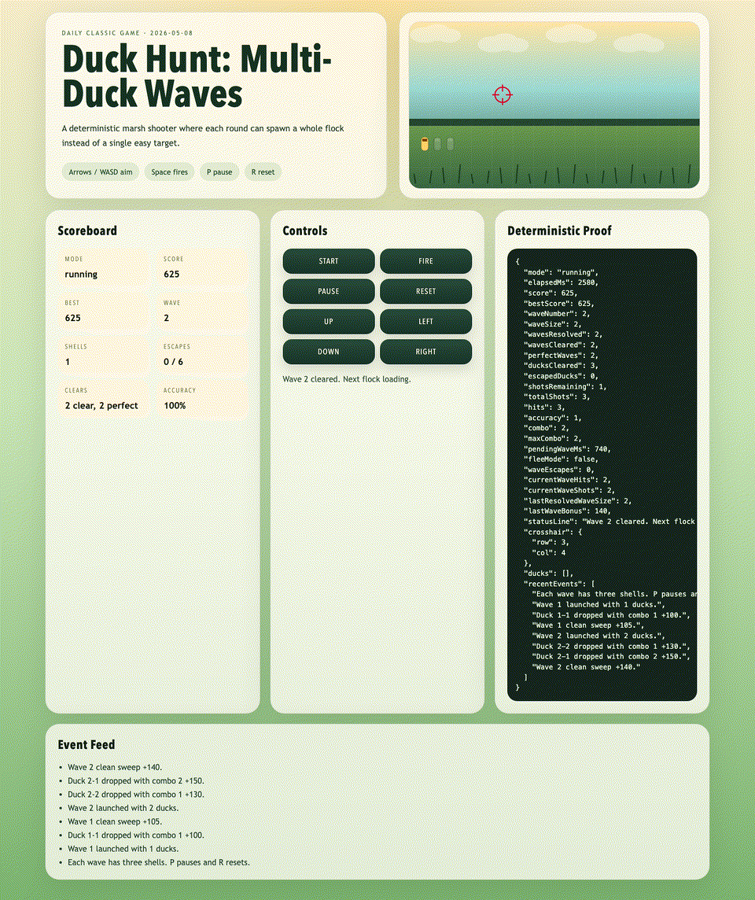
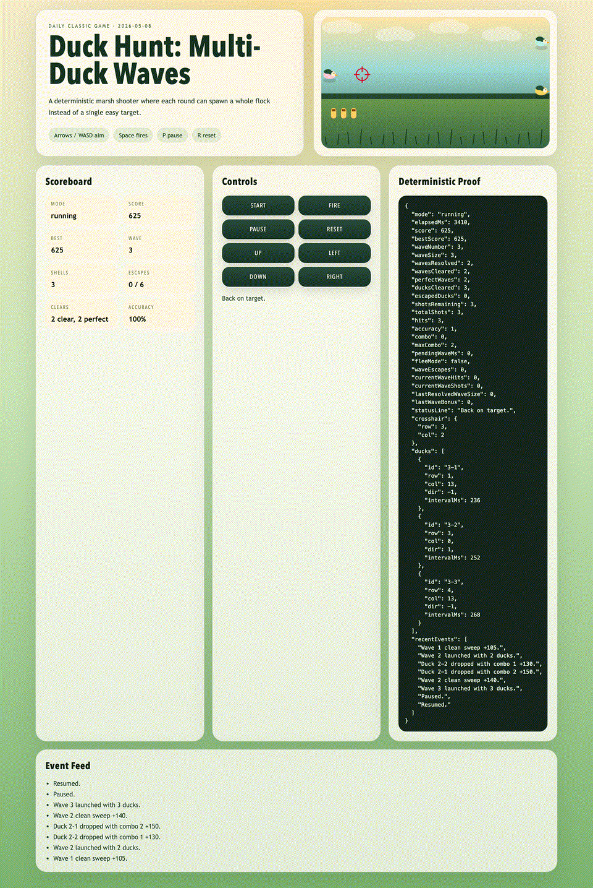

# daily-classic-game-2026-05-08-duck-hunt-multi-duck-waves

<p align="center"><strong>Deterministic Duck Hunt with stacked flock waves, three-shell pressure, and proof-friendly autoplay.</strong></p>
<p align="center">Track a growing marsh flock, land combo shots before the chamber runs dry, and survive long enough to keep the clean-sweep bonuses flowing.</p>
<p align="center">
  
  
  
</p>

## Quick Start

```bash
pnpm install
pnpm dev
```

```bash
pnpm test
pnpm build
pnpm capture
```

## How To Play

- Press `Start`, `Enter`, or `Space` to begin the run.
- Move the crosshair with the arrow keys or `WASD`.
- Press `Space` to fire once the hunt is live.
- Press `P` to pause and `R` to reset the board back to the title state.

## Rules

- Every wave carries exactly three shells, so missed shots force the remaining ducks into a faster escape run.
- Ducks that leave the board count as escapes; six total escapes ends the run.
- Clearing every duck in a wave schedules the next flock after a short marsh reset.
- The game is fully deterministic, so the same seed, inputs, and autoplay path always reproduce the same results.

## Scoring

- `+100` for a basic duck hit.
- `+30` extra per duck in larger waves, making two- and three-duck flocks more valuable.
- `+20` per combo step after the first consecutive hit.
- `+40 + 45 * wave_size + 10 * shells_left` for a clean-sweep wave bonus.

## Twist

Classic Duck Hunt usually isolates one or two easy targets. This version leans into multi-duck spawn waves, so even early rounds can fill the sky with a staggered flock that demands route planning, shell discipline, and quick crosshair repositioning.

## Verification

- `pnpm test`
- `pnpm build`
- `pnpm capture`
- Browser hooks:
  - `window.advanceTime(ms)`
  - `window.render_game_to_text()`
- Playwright proof files:
  - `artifacts/playwright/action_payload.json`
  - `artifacts/playwright/state-1.json`
  - `artifacts/playwright/state-2.json`
  - `artifacts/playwright/state-3-reset.json`

### GIF Captures

- `clip-01-opening-wave.gif`: scripted autoplay opening the first wave and settling the crosshair.
- `clip-02-clean-sweep.gif`: a clean-sweep proof clip showing combo scoring through a multi-duck flock.
- `clip-03-pause-reset.gif`: pause overlay followed by the deterministic reset back to title.

## Project Layout

```text
assets/gifs/               Generated GIF captures
docs/plans/                Run-specific implementation plan
scripts/                   Self-check and Playwright capture scripts
src/                       Deterministic game core, autoplay, and UI
tests/                     Node-based gameplay verification
vercel.json                Static deployment settings
```
